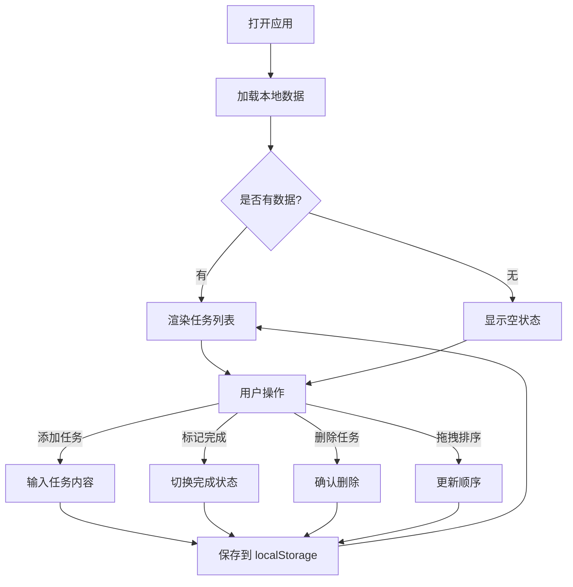

# 待办事项应用 - 产品需求文档

## 1. 产品概述

一个简洁优雅的待办事项管理应用，帮助用户高效管理日常任务。支持任务的添加、删除、标记完成，数据本地持久化，支持拖拽排序和移动端完美适配。

- 核心价值：简单、高效、本地化的任务管理工具
- 目标用户：需要管理日常待办事项的个人用户

## 2. 核心功能

### 2.1 功能模块

1. **主页面**: 任务输入、任务列表、操作按钮

### 2.2 页面详情

| 页面名称 | 模块名称 | 功能描述 |
|---------|---------|---------|
| 主页面 | 任务输入区 | 文本输入框和添加按钮，支持回车快捷添加 |
| 主页面 | 任务列表 | 显示所有待办事项，支持拖拽重新排序 |
| 主页面 | 任务项 | 显示任务内容、完成状态复选框、删除按钮 |
| 主页面 | 状态栏 | 显示任务统计（总数、已完成数、待完成数） |

## 3. 核心流程

## 4. 用户界面设计

### 4.1 设计风格

- **主题色**: 温暖的琥珀色（Amber）作为主色调，搭配中性灰色系
- **辅助色**: 成功绿色（已完成）、危险红色（删除）
- **按钮风格**: 圆角按钮，柔和阴影，平滑过渡动画
- **字体**: 使用 "Outfit" 作为标题字体，"Inter" 作为正文字体（现代简约）
- **布局风格**: 卡片式布局，居中对齐，最大宽度限制
- **图标风格**: 简洁线性图标（lucide-react）

### 4.2 页面设计概览

| 页面名称 | 模块名称 | UI 元素 |
|---------|---------|---------|
| 主页面 | 任务输入区 | 白色卡片，圆角输入框，琥珀色主按钮，阴影效果 |
| 主页面 | 任务列表 | 垂直排列的任务卡片，每项带复选框、文本、删除按钮 |
| 主页面 | 任务项 | 左侧圆形复选框，中间任务文本，右侧删除图标 |
| 主页面 | 状态栏 | 底部固定，半透明背景，显示任务统计 |
| 主页面 | 拖拽状态 | 拖拽时卡片轻微上浮，增加阴影，半透明效果 |

### 4.3 响应式设计

- **桌面优先**: 最大宽度 600px，居中显示
- **移动端适配**: 全宽布局，触摸优化
  - 增大触摸区域（最小 44px）
  - 优化间距和字体大小
  - 禁用双指缩放，防止误操作
- **触摸优化**: 拖拽手柄清晰可见，滑动手势友好

### 4.4 交互动效

- 任务添加：从顶部滑入动画
- 任务删除：向左滑出并淡出
- 完成状态切换：复选框缩放动画，文本划线效果
- 拖拽时：卡片浮起、阴影增强
- 悬停状态：按钮背景色过渡、阴影变化