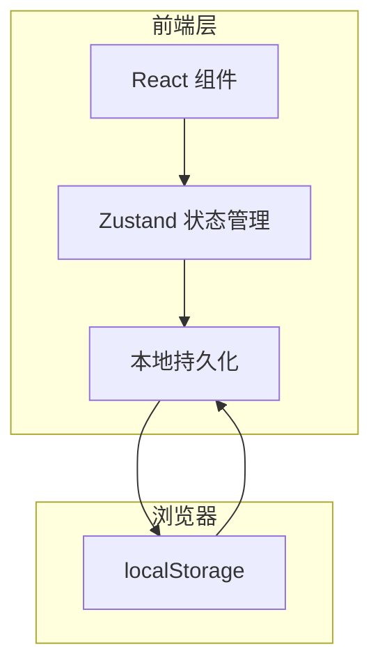
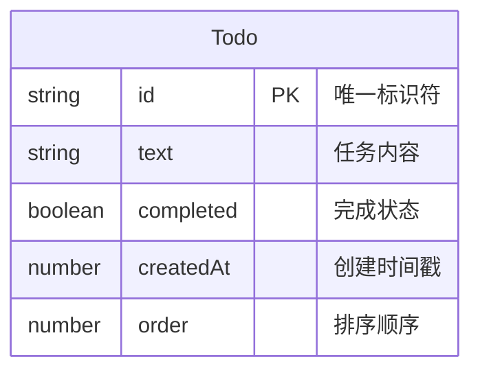

# 待办事项应用 - 技术架构文档

## 1. 架构设计



## 2. 技术说明

- **前端框架**: React 18 + TypeScript
- **构建工具**: Vite
- **样式方案**: Tailwind CSS 3
- **状态管理**: Zustand（轻量级状态管理）
- **拖拽功能**: @dnd-kit/core + @dnd-kit/sortable（现代拖拽库）
- **图标库**: lucide-react
- **后端服务**: 无（纯前端应用）
- **数据存储**: 浏览器 localStorage

## 3. 路由定义

| 路由 | 用途 |
|-----|------|
| / | 主页面，显示所有待办事项 |

## 4. 数据模型

### 4.1 数据模型定义



### 4.2 TypeScript 类型定义

```typescript
interface Todo {
  id: string;           // 唯一标识符（使用 crypto.randomUUID()）
  text: string;         // 任务内容
  completed: boolean;   // 是否完成
  createdAt: number;    // 创建时间（时间戳）
  order: number;        // 排序顺序
}

interface TodoStore {
  todos: Todo[];
  addTodo: (text: string) => void;
  removeTodo: (id: string) => void;
  toggleTodo: (id: string) => void;
  reorderTodos: (newOrder: Todo[]) => void;
}
```

## 5. 核心实现要点

### 5.1 localStorage 持久化

- 使用 Zustand 的 persist 中间件自动同步
- 存储 key: `todo-app-data`
- 数据变更自动保存，刷新不丢失

### 5.2 拖拽排序

- 使用 @dnd-kit 库实现现代化拖拽
- 支持键盘辅助功能（无障碍）
- 触摸设备优化

### 5.3 响应式设计

- Tailwind 的响应式类实现移动端适配
- 断点：sm:640px 以下为移动端
- 触摸区域最小 44px

## 6. 项目目录结构

```
src/
├── components/
│   ├── TodoInput.tsx        # 任务输入组件
│   ├── TodoItem.tsx         # 单个任务项组件
│   ├── TodoList.tsx         # 任务列表组件
│   └── TodoStats.tsx        # 任务统计组件
├── hooks/
│   └── useTodoStore.ts      # Zustand 状态管理
├── pages/
│   └── Home.tsx             # 主页面
├── utils/
│   └── storage.ts           # localStorage 工具函数
├── App.tsx                  # 应用入口
├── main.tsx                 # 渲染入口
└── index.css                # 全局样式
```

## 7. 依赖包

```json
{
  "dependencies": {
    "react": "^18.3.1",
    "react-dom": "^18.3.1",
    "react-router-dom": "^6.26.0",
    "zustand": "^4.5.0",
    "@dnd-kit/core": "^6.1.0",
    "@dnd-kit/sortable": "^8.0.0",
    "@dnd-kit/utilities": "^3.2.2",
    "lucide-react": "^0.400.0"
  },
  "devDependencies": {
    "@types/react": "^18.3.0",
    "@types/react-dom": "^18.3.0",
    "typescript": "^5.5.0",
    "vite": "^5.4.0",
    "tailwindcss": "^3.4.0"
  }
}
```